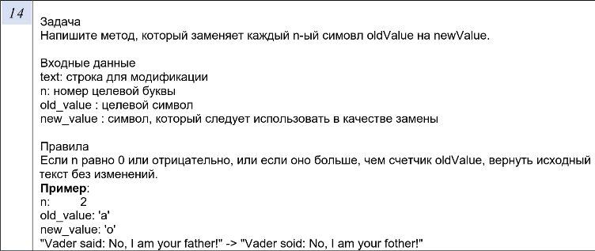

# Лабораторная работа №1. Вариант 14.




## Краткий разбор реализации

1. Функция `ReplaceEveryNth(std::string& text, int n, char old_value, char new_value)` выполняет замену каждого n-го символа по условию задачи. Также внутри неё реализована проверка крайних случаев:
- пустая входная строка;
- отрицательное или нулевое значение `n`;
- совпадение `old_value` и `new_value`;
- `n` превышает количество искомых символов во входной строке.


2. Основная логика работы алгоритма:
- Подсчёт общего числа символов `old_value` во входной строке
- Поиск и замена каждого n-го вхождения `old_value` на `new_value`
- Сброс счётчика после каждой замены для поиска следующего n-го вхождения


## Сборка и запуск лабораторной

### Сборка:
```bash
cd lab_1
mkdir build
cd build
cmake ..
cmake --build .
```

### Запуск:
```bash
# Из директории build
./lab_1_exe
```

### Запуск тестов:
```bash
# Из директории build
./tests
```